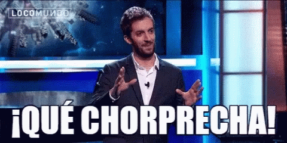

## Bloqueo y Filtrado

Según la [Internet Society](https://www.internetsociety.org/es/)

A los usuarios finales se lesniega el acceso a ciertos contenidos en línea
en función de determinados controles reglamentarios u objetivos de negocio
de los proveedores de servicios de internet.

- Algunos consideran que el filtrado selectivo del contenido de internet va
en contra de los principios de acceso libre y abierto, especialmente si es
para favorecer el ISP

