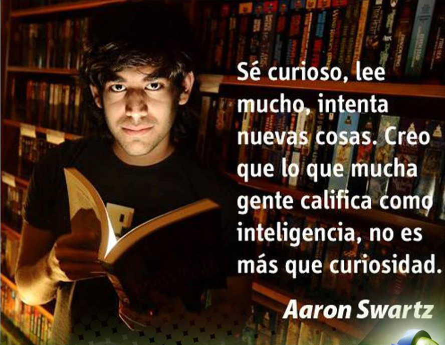

## In memoriam:

- Gracias a todos los padres que en algún momento prohibieron jugar con el ordenador
a sus hijos.
- Gracias a todos los gobiernos que dijeron que eramos unos piratas por ratas y no
por curiosidad. (quedando en evidencia con Netflix, Spotify, Amazon...)
- O aprender Python, TDD, Asincronía....
- Compartir es vivir.
- Y sobretodo Gracias, a aquellos que dieron su vida para que tú y yo, podamos simplemente
mandar un meme o usar gifs en una charla.

