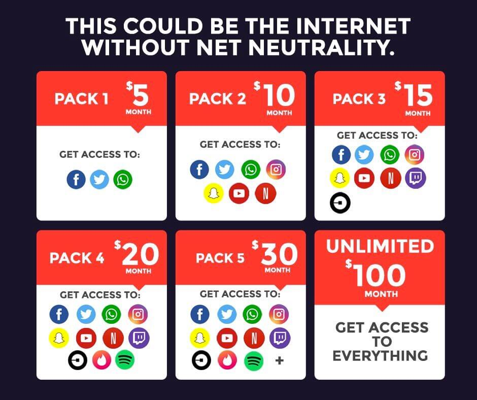

## Servicios zero-rating

Se refiere a una práctica comercial según la cual determinados contenidos
contenidos de internet se entregan al usuario final en forma gratuita.

Esto se puede dar para sacar un beneficio directo (incremento de usuarios)
o indirecto (pagos per click de los servicios ofrecidos gratuitamente)

Este es uno de los puntos más polémicos que podrían llegar a dar escenarios como:

[end](end.md)