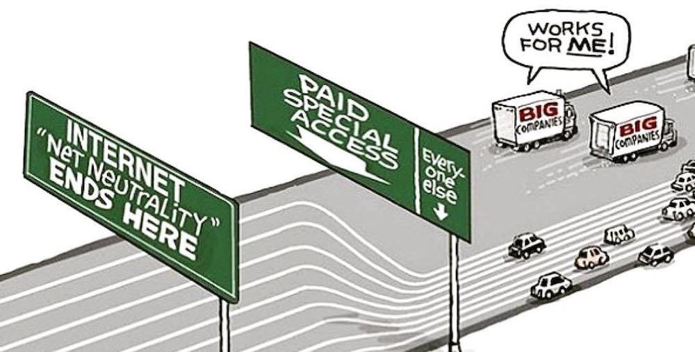

## Vias rápidas

Se refiere a la práctica de dar tratamiento preferencial a ciertos flujos
de datos sobre la base de acuerdos comerciales suscritos entre operadores 
de internet.

- Hay quienes ven en estos acuerdos una práctica discriminatoria inaceptable
que da tratamiento preferencial a ciertos datos en la red y que podría degradar
el desempeño de otros.

- Sin embargo, otros ven en las "vías rápidas"una manera eficaz de entregar
contenido a los usuarios con una mejor calidad de servicio.

[Siguiente](estrangulamiento.md)